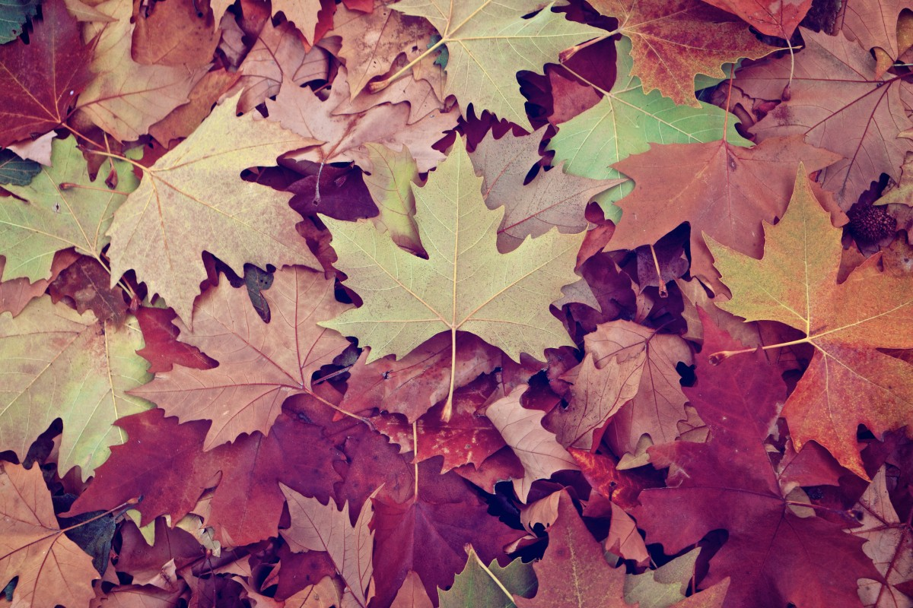

Je m'appelle Hawa, je suis **designer UX/UI** en Belgique et dans le monde.

 

J'ai retapé des tonnes de PCs et relancé des tonnes de programmes. J'ai appris à me dépatouiller **seule ou en équipe** et à me faire comprendre d'à peu près n'importe qui.

Puis j'ai compris que la solution à tous les problèmes, c'était de concevoir des interfaces **super accessibles et qui déchirent**. 
Donc maintenant, je passe mon temps à écouter les utilisateurs, à faire de la recherche, et à **garder l'humain à cœur dans tous mes designs**.


graph LR;
A[Utilisateur pas content]-->B[Lemonade];
B-->C[Profit]


### Sinon j'aime beaucoup :
- Le bircher muesli
- Le festival de la chanson italienne
- Le [focus visible lors de la navigation au clavier](https://www.elevenways.be/fr/articles/tout-ce-que-vous-devez-savoir-sur-accessibilite-obligatoire-des-applications-gouvernementales)
- Le [pump](https://i.pinimg.com/originals/00/db/ab/00dbabf281ced0eed5d3f00290a81c19.png)

### Je n'aime pas :
- Les films sur le cyclimse

## Quelques outils que j'utilise

- Debian
- Figma
- Miro
- Offload

## CV


Télécharger mon CV


