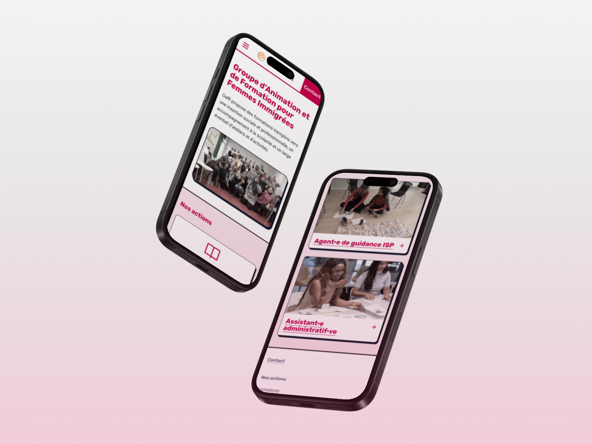
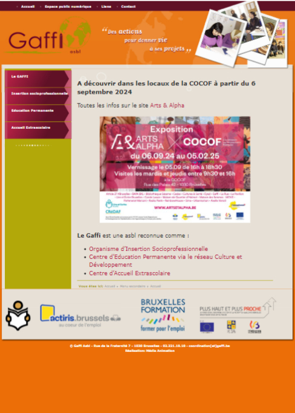
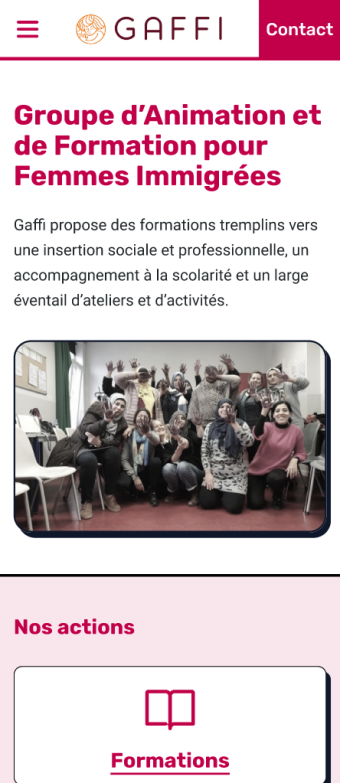
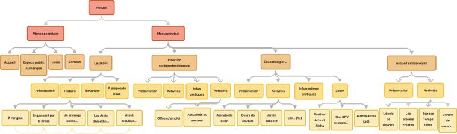
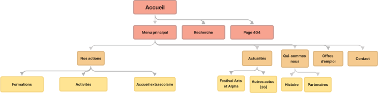
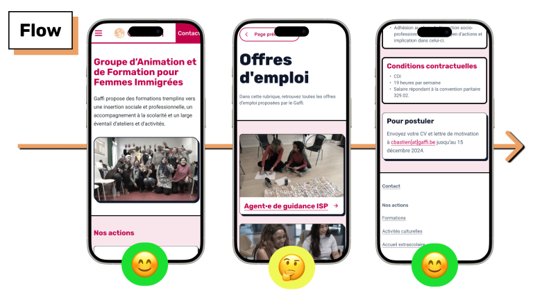
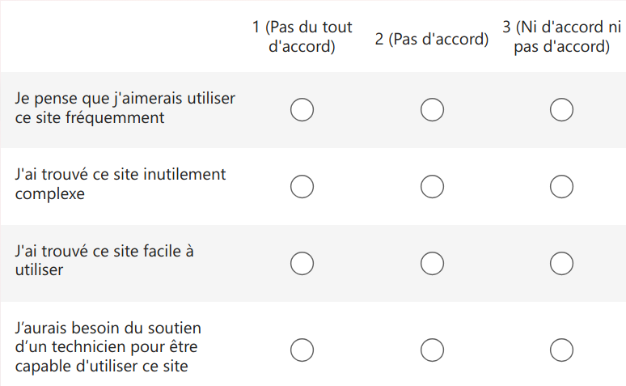


Modernisation and responsive, accessible, green re-design of a website following UX audit and user testing


 

## Case study

### Issues and recommendations

<table>
<tr>
<td>

 

</td>
<td>

</td>
</tr>
</table>

This website wasn't compatible with smaller screens. The colors were lacking in contrast (2.47:1). The EU directive on web accessibility requires a score of 4.5:1 or better.

I created an accessible visual identity (rapport 15.13:1, 6.19:1) and a responsive design, making the site usable on screens under a width of 800 pixels.

The site's information architecture made navigation complex. There was repetition of some info. The most attractive and up to date content was hidden deep in the site's navigation.

I cut down a lot of pages to make information easier to find. I merged and renamed some pages to make them easier to understand.

### Green IT and A11y

I decided to go for a mobile-first design, to make it lighter and easier on less resource-hungry. I also reduced media resolution and saturation, and created a design system with only three different colors.

### User testing

After creating an interactive prototype for my design, I tested it with 5 users who would be part of the target for the non-profit.

 


type: 'doughnut',
data: {
  labels: ['SUS Score','Null'],
  datasets: [{
    label: 'Prototype average SUS score',
    data: [80,20],
  backgroundColor: [
  'rgba(54, 162, 235, 0.7)',
      'rgba(255, 205, 86, 0.7)'
    ],
    borderWidth: 0,
    hoverOffset: 2
  }]
}


The users navigated through the prototype to complete to tasks (register for training and applying for a job). They then completed the SUS, a standardized post-usability test questionnaire.

The prototype got an average score of 80%. This shows that the user interface est not only usable and functional, but also simple to understand, and a pleasure to navigate through.

Quelques citations verbatim des testeuses : 

<blockquote>

I am glad that I have a phonecall as an option.

</blockquote>

<blockquote>

It's actually nice [...], it's pleasant to use.

</blockquote>

## Prototype

<iframe style="border: 1px solid rgba(0, 0, 0, 0.1);" width="390" height="650" src="https://embed.figma.com/proto/IkuwE3smkuJ4sor0JjS7Tr/Projet?node-id=864-4895&node-type=frame&scaling=min-zoom&content-scaling=fixed&page-id=864%3A3869&starting-point-node-id=864%3A4895&hotspot-hints=0&embed-host=share" allowfullscreen></iframe>

## Tools I worked with

- Paper and pencils
- Capian
- UXTweak
- Figma
- Miro
- [redacted] Analytics

