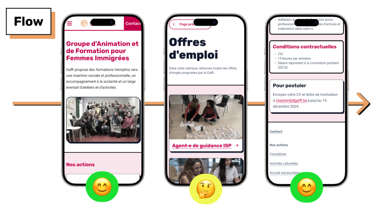


Modernisation et adaptation responsive, accessible et écoresponsable de site après recherche UX


 

## Étude de cas

### Problèmes identifiés et recommandations

<table>
<tr>
<td>

 

</td>
<td>

</td>
</tr>
</table>

Le site n'était pas compatible avec les écrans mobiles. Les associations de couleurs manquaient de contraste (rapport : (2.47:1)). La directive européenne sur l'accessibilité web requiert un rapport de 4.5:1 ou plus.

J'ai proposé une charte graphique accessible (rapport 15.13:1, 6.19:1) ainsi qu'un design responsive qui s'adapte à l'écran en dessous de 600px de largeur.

L'architecture du site rendait la navigation inutilement compliquée. Des informations se répétaient sur plusieurs pages, et le contenu le plus à jour n'était pas mis en avant.

J'ai proposé d'élaguer le plan du site, avec une architecture vraiment simplifiée. J'ai aussi fusionné et renommé certaines pages pour améliorer la compréhension et fluidifier le parcours utilisateur.

### Démarche écoresponsable et accessible

Pour alléger le site, et réduire sa consommation d'énergie, j'ai conçu mon prototype en mobile-first, réduit la résolution et la saturation des images, et minimisé le nombre de couleurs dans la charte graphique.

### Tests

Après avoir conçu un prototype interactif de mon nouveau design, j'ai recruté 5 testeuses correspondant au public cible de l'ASBL.

 


type: 'doughnut',
data: {
  labels: ['Score SUS','Néant'],
  datasets: [{
    label: 'Score SUS moyen du proto',
    data: [80,20],
  backgroundColor: [
  'rgba(54, 162, 235, 0.7)',
      'rgba(255, 205, 86, 0.7)'
    ],
    borderWidth: 0,
    hoverOffset: 2
  }]
}


Après avoir parcouru le prototype et réalisé deux tâches (s'inscrire à une formation et postuler à une offre d'emploi), elle se sont autoadministré un questionnaire SUS traduit en français.

La note moyenne attribuée au prototype était de 80%. Un score de 80% au SUS indique que l'interface est non seulement utilisable, mais simple et agréable à parcourir.

Quelques citations verbatim des testeuses : 

<blockquote>

Je suis contente d'avoir l'option de téléphoner.

</blockquote>

<blockquote>

C'est quand même bien, c'est agréable à utiliser.

</blockquote>

## Prototype interactif

<iframe style="border: 1px solid rgba(0, 0, 0, 0.1);" width="390" height="650" src="https://embed.figma.com/proto/IkuwE3smkuJ4sor0JjS7Tr/Projet?node-id=864-4895&node-type=frame&scaling=min-zoom&content-scaling=fixed&page-id=864%3A3869&starting-point-node-id=864%3A4895&hotspot-hints=0&embed-host=share" allowfullscreen></iframe>

## Outils utilisés

- Des crayons, du papier
- Capian
- UXTweak
- Figma
- Miro
- [redacted] Analytics

