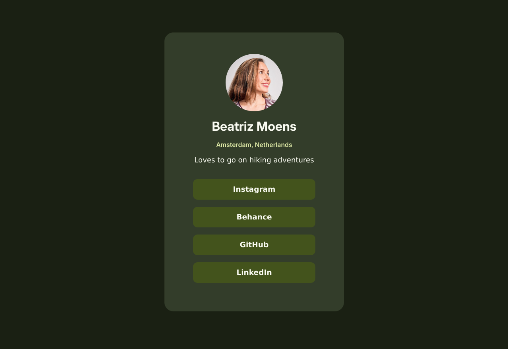


Responsive and accessible social media link profile


## Screens 

 

## Live site

<iframe src="https://contrebasses.github.io/social-links/" width="350px" height="600px"></iframe>

## Tools I worked with

- Vanilla HTML/CSS
- Kate
- Figma

