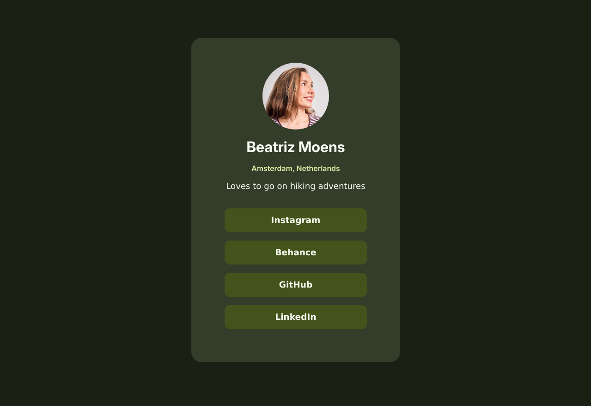


Une page de profil/liens responsive et accessible


## Écrans 

 

## En live

<iframe src="https://contrebasses.github.io/social-links/" width="350px" height="600px"></iframe>

## Outils utilisés

- Vanilla HTML/CSS
- Kate
- Figma

