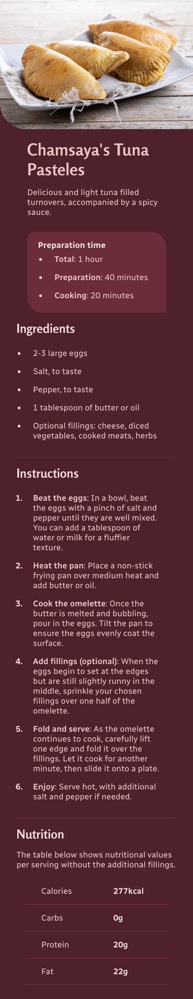
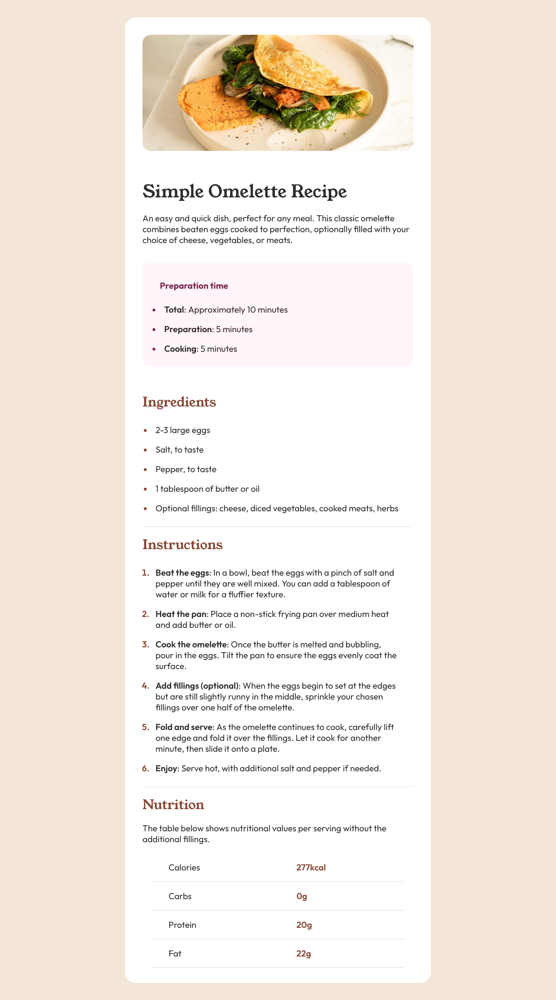


Just a spoonful of sugar...


 

## Storytime

This started as a practical exercise on using CSS grids. I made the decision to keep developing it to add different features. The desktop layout was a pain in the ass to build, but I did it with no masonry!

In the future, I will work on dynamically displaying a new recipe at every page load.

## Screens 

 
 

## Live site

<iframe src="https://contrebasses.github.io/recipe/" width="350px" height="600px"></iframe>

## Tools I worked with

- Vanilla HTML/CSS
- VS Code
- Mom's spaghetti
